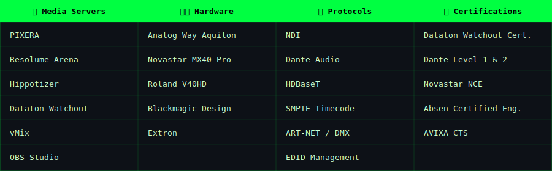

<!-- AKHIL SEKHAR — GitHub Profile README -->
<!-- Repo: akhilzekhar/akhilzekhar -->

> Eexperienced in high-end, mission-critical live events - the kind that demands everything works, every time, with zero margin for error.
>
> On the side, I build **modules, experiments, and tools** — hardware cue interfaces, video integration triggers, show control utilities, and some web development. Not a full-time developer, but can build some niche solutions.

---

---

📡 **[Power Behind the Show](https://akhilsekhar.com)** — Electrical power for AV professionals. Course launching soon.
